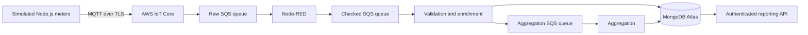

# BMOAS: Broadcast Media Observation and Aggregation System

BMOAS is an IoT architecture project for SIT314. It models how a ratings service could collect observations from a panel of listeners, associate detected broadcasts with registered participants, and produce counts by media source, region and reporting period. The meters and media detection are simulated. The processing services, database, queues and cloud deployment use real software and infrastructure.

## Architecture



Node-RED, validation, aggregation and reporting run on ECS/Fargate. CloudWatch records logs, processing measurements, queue depth, CPU use and task counts. Atlas is deployed in AWS Sydney. Services use private network interfaces, TLS, scoped IAM permissions and injected secrets.

## Functional requirements

- Generate observations with stable event identifiers and a registered device, participant and gateway.
- Validate the event structure, registry relationships and timestamps, then quarantine invalid input.
- Retain events during disconnection and replay them when connectivity returns.
- Handle duplicate deliveries without increasing ratings counts twice. Reject conflicting payloads that reuse an event identifier.
- Record observations with no detected media and route late observations for review.
- Update observation counts and distinct participant counts within each reporting period using MongoDB transactions.
- Provide an authenticated API for experiment summaries and ratings grouped by source, region and period.

The system measures observations and panel participation. It does not implement audio recognition, physical BLE measurements, population weighting or a commercial audience estimate.

## Run locally

Use Node.js 22.16 or later and Docker with Compose.

```sh
npm ci
npm run check
npm test
bash scripts/local-init.sh
```

The setup script starts Mosquitto, ElasticMQ and a MongoDB replica set, prepares local configuration, seeds the registry and runs the MongoDB integration test. Then run each service in its own terminal:

```sh
npm run bridge
npm run node-red
npm run validator
npm run aggregator
npm run api
```

Publish a small example from another terminal:

```sh
npm run simulate -- --profile smoke --run smoke-001
```

This publishes 200 observations. Inspect `runs/smoke-001/manifest.json` and query `/v1/runs/smoke-001` or `/v1/reports?run_id=smoke-001` on port 8080 using the API token generated in your local `.env`. Node-RED is available locally at `http://127.0.0.1:1880/red/`.

See [local verification](docs/LOCAL_VERIFICATION.md) for the full procedure. `docker compose down` stops the local containers and retains their volumes.

## Tutor feedback revision

The original design scaled aggregation using a CPU target. The revision reduces database operations for new observations, batches SQS requests, reduces repeated Node-RED status updates, and adds scaling for Node-RED and validation. Queue depth and message age can trigger faster scale-out. Validation timings distinguish time spent processing, writing to the database and forwarding messages.

See [changes](docs/CHANGES.md) and [evaluation](docs/EVALUATION.md). Comparisons use the original and revised application on the same database tier. Fixed-capacity trials separate software changes from the extra capacity available when all processing stages scale. Stepped and reconnect trials measure throughput, p95 latency, queue recovery, errors and resource use.

## Further latency improvements

Aggregation now batches transactions and partitions each logical ratings bucket across 64 participant groups. Reporting merges those groups into the original API response. Optional scheduled capacity can prepare all three stages before anticipated demand. Final cloud trials measured p95 of 226 ms at 100/s and 288 ms at 1,000/s over 120 seconds. Reconnect completed 62,000 observations with exact ratings. See [successive changes and measured limits](docs/LATENCY_REVISION.md). The original 900 second trial is retained as an earlier unsuccessful attempt.

## Repository guide

| Location | Purpose |
|---|---|
| `src/` | Meter simulator, event rules, queue clients, database operations and services |
| `node-red/` | Processing flow, settings and custom queue nodes |
| `infra/` | AWS CloudFormation templates |
| `config/` | Schemas, workload profiles and configuration examples |
| `scripts/` | Local setup, deployment, collection and verification tools |
| `test/` | Unit, flow, queue, scaling configuration and database integration tests |
| `docs/` | Design decisions, deployment guidance and evaluation status |
| `.github/workflows/` | Automated checks and manually triggered deployment workflow |

## AWS deployment

Follow [AWS setup](docs/AWS_SETUP.md). Deployment creates billable resources. Supply your own AWS account and Atlas cluster, generate dedicated meter certificates, and initialise the database before starting services. Review the account confirmation and remove temporary resources after testing. The manually triggered deployment workflow also requires repository variables, an approved GitHub environment and an AWS role configured for OIDC.

Configuration examples contain placeholders. Passwords, tokens, certificates, private keys, personal paths and live runtime configuration are excluded from this repository. Cloud reporting is private and can be queried through authorised ECS Exec access.

## Assessment and AI acknowledgement

This repository supports the project report and the separate evaluation of changes made following tutor feedback. OpenAI ChatGPT and Codex assisted with generating and revising the code, configuration, tests and documentation, and with deployment support and analysis. The student remains responsible for reviewing the work, interpreting the results and explaining the architectural decisions.

The repository is public for assessment access. No GitHub invitation is required. The report copy published here omits the student number from its cover.
