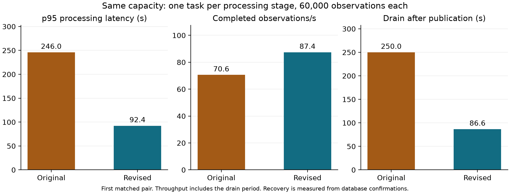

# Evaluation status

Updated 4 October 2026, Australian local time. The matched cloud comparison is in progress.

| Check | Measured result |
|---|---|
| Automated tests | 55 passed |
| MongoDB integration | Passed |
| Local Node-RED and queue integration | 500 unique observations and 25 duplicate deliveries, exact ratings counts matched |
| Revised cloud smoke | 200 generated and 200 completed, exact event identifiers and ratings counts matched |
| Cloud smoke p95 processing latency | 210 ms |
| API authentication | HTTP 401 without a token, HTTP 200 with a valid token |
| Cloud invalid-input checks | Two unique valid/late records retained, one late event routed for review, two invalid messages quarantined |
| Original fixed-capacity baseline | 60,000 observations completed after natural drain, p95 245,993 ms |

The original fixed trial held one task per processing stage. Aggregation CPU was approximately 100%, while upstream queues remained small. The initial 720-second collection window ended before the aggregation queue drained. The original snapshot was retained and final database reconciliation confirmed all 60,000 events. Continuous queue and task sampling covers only the initial window. Database confirmation times remain available for final latency and recovery calculations.

## First matched fixed-capacity comparison

Both implementations completed all 60,000 observations with exact identifiers and ratings counts. Each processing stage had one task, using the same M30 database tier and workload.

| Metric | Original | Revised |
|---|---:|---:|
| p95 processing latency | 246.0 s | 92.4 s |
| Completion throughput including drain | 70.6 observations/s | 87.4 observations/s |
| Last confirmation after publication ended | 250.0 s | 86.6 s |

This first pair shows about 62% lower p95 latency, 24% higher completion throughput and 65% less time to finish the backlog. The revised trial used the same publication workload and a longer collection window. Both final latency and recovery calculations use stored confirmation timestamps. The original run has a gap in continuous queue and task sampling after its initial collection window. One pair provides an initial comparison, with variability still to be assessed.

Repeated stepped and reconnect trials are now evaluating the original aggregation-only scaling policy against scaling across all processing stages. These trials will establish the effect of the scaling changes separately from the fixed-capacity comparison.

Smoke latency describes a small functional test. The final comparison will report the offered and completed rates, p95 processing latency, errors, backlog recovery, CPU and memory, task counts and scaling timing. Resource differences will accompany performance comparisons.

GitHub automated checks passed for the initial implementation commit, including syntax, all 55 tests, MongoDB integration and Docker build.
