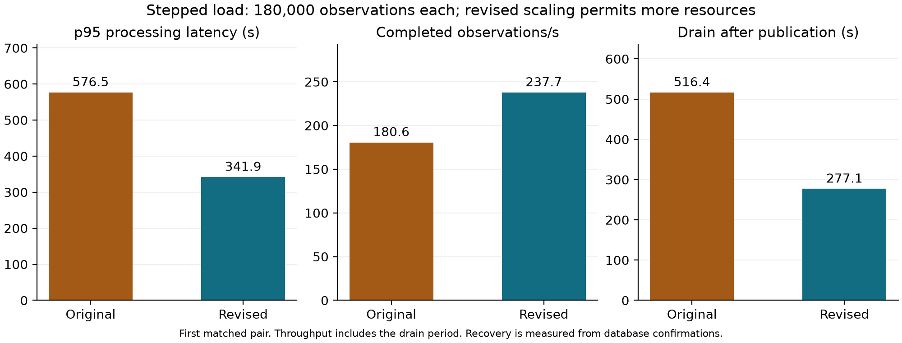
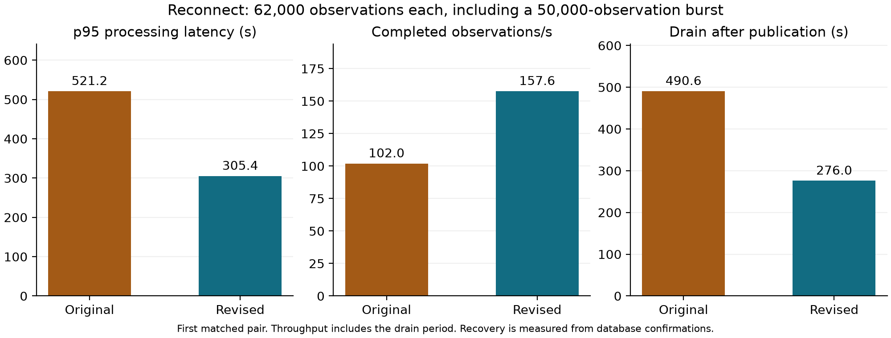
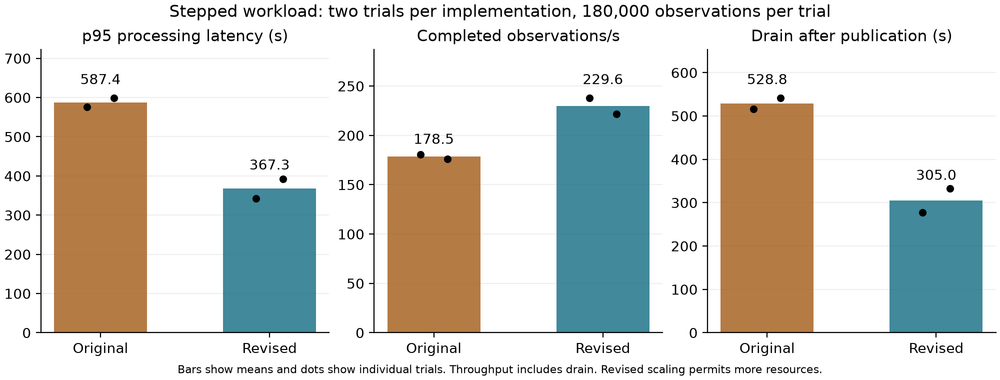

# Evaluation status

Updated 4 October 2026, Australian local time. The matched cloud comparison is in progress.

| Check | Measured result |
|---|---|
| Automated tests | 55 passed |
| MongoDB integration | Passed |
| Local Node-RED and queue integration | 500 unique observations and 25 duplicate deliveries, exact ratings counts matched |
| Revised cloud smoke | 200 generated and 200 completed, exact event identifiers and ratings counts matched |
| Cloud smoke p95 processing latency | 210 ms |
| API authentication | HTTP 401 without a token, HTTP 200 with a valid token |
| Cloud invalid-input checks | Two unique valid/late records retained, one late event routed for review, two invalid messages quarantined |
| Original fixed-capacity baseline | 60,000 observations completed after natural drain, p95 245,993 ms |

The original fixed trial held one task per processing stage. Aggregation CPU was approximately 100%, while upstream queues remained small. The initial 720-second collection window ended before the aggregation queue drained. The original snapshot was retained and final database reconciliation confirmed all 60,000 events. Continuous queue and task sampling covers only the initial window. Database confirmation times remain available for final latency and recovery calculations.

## First matched fixed-capacity comparison

Both implementations completed all 60,000 observations with exact identifiers and ratings counts. Each processing stage had one task, using the same M30 database tier and workload.

| Metric | Original | Revised |
|---|---:|---:|
| p95 processing latency | 246.0 s | 92.4 s |
| Completion throughput including drain | 70.6 observations/s | 87.4 observations/s |
| Last confirmation after publication ended | 250.0 s | 86.6 s |

This first pair shows about 62% lower p95 latency, 24% higher completion throughput and 65% less time to finish the backlog. The revised trial used the same publication workload and a longer collection window. Both final latency and recovery calculations use stored confirmation timestamps. The original run has a gap in continuous queue and task sampling after its initial collection window. One pair provides an initial comparison, with variability still to be assessed.

The completed evaluation contains one fixed pair, two stepped pairs and one reconnect pair. These compare the original aggregation-only scaling policy with scaling across all processing stages. The supervisor omitted the second reconnect pair to preserve the cleanup window.

Smoke latency describes a small functional test. The retained measurements include the offered and completed rates, p95 processing latency, errors, backlog recovery, CPU and memory, task counts and scaling timing. Resource differences accompany the performance comparisons.

GitHub automated checks passed for the initial implementation commit, including syntax, all 55 tests, MongoDB integration and Docker build.

## First matched stepped comparison

Both runs completed all 180,000 observations with exact event identifiers and ratings counts.

| Metric | Original scaling | Revised scaling |
|---|---:|---:|
| p95 processing latency | 576.5 s | 341.9 s |
| Completion throughput including drain | 180.6 observations/s | 237.7 observations/s |
| Last confirmation after publication ended | 516.4 s | 277.1 s |

The revised configuration reduced p95 latency by about 41% and the time to finish the backlog by about 46%. Completion throughput including drain increased by about 32%. These are results from one pair. The revised design allows more capacity: sampled running task counts imply approximately 29% more provisioned processing vCPU-seconds between first publication and final confirmation, excluding reporting and time outside that interval.

Aggregation first reached two running tasks about four minutes into the revised trial, compared with about six minutes in the original. Node-RED and validation gained capacity much later, around the end of publication. The remaining latency and delayed upstream scaling remain relevant limitations to evaluate in the repeated trials.

## First matched reconnect comparison

Each run completed all 62,000 observations, including a 50,000-observation reconnect burst. Exact identifiers and ratings counts matched.

| Metric | Original scaling | Revised scaling |
|---|---:|---:|
| p95 processing latency | 521.2 s | 305.4 s |
| Completion throughput including drain | 102.0 observations/s | 157.6 observations/s |
| Last confirmation after publication ended | 490.6 s | 276.0 s |

The first pair shows about 41% lower p95 latency and 44% less time to finish the backlog. Completion throughput including drain increased by about 55%. These results include the additional processing stages that can scale in the revised design. The second reconnect pair was omitted by the deployment deadline gate.

## Completed stepped repetitions

Eight formal trials completed 964,000 observations in total. Each trial reconciled exact observation identifiers and ratings. The two stepped repetitions for each implementation gave the following results.

| Metric | Original trial 1 | Original trial 2 | Revised trial 1 | Revised trial 2 |
|---|---:|---:|---:|---:|
| p95 latency (s) | 576.5 | 598.4 | 341.9 | 392.8 |
| Completed observations/s including drain | 180.6 | 176.3 | 237.7 | 221.5 |
| Recovery after publication (s) | 516.4 | 541.1 | 277.1 | 332.8 |

Across these two repetitions, mean p95 fell from 587.4 to 367.3 seconds, mean completion throughput rose from 178.5 to 229.6 observations/s, and mean recovery fell from 528.8 to 305.0 seconds. These represent approximately 37%, 29% and 42% improvements respectively. The sample is small and individual results are retained to show variation. Each stepped run offered 100, 300, 1,000 and 100 observations/s for two minutes each. The mean completion rate includes the period needed to finish the backlog.

The changes improve how quickly ratings become available while preserving their counts. Further delay remains under large workloads. Node-RED and validation still gain running capacity late in the stepped trial, and revised scaling consumes more processing resources. The separate revision report will examine these stage timings and resource use alongside the application outcomes.

## Validation delay and resource use

The revised validator emitted a timing sample for every observation in each formal revised trial. This separates time waiting in its input queue from time spent handling the observation.

| Revised workload | Observations sampled | p95 queue residence | p95 database persistence | p95 complete handler |
|---|---:|---:|---:|---:|
| Fixed | 60,000 | 0.258 s | 8.38 ms | 31.02 ms |
| Stepped trial 1 | 180,000 | 81.587 s | 21.05 ms | 48.06 ms |
| Stepped trial 2 | 180,000 | 36.818 s | 24.01 ms | 47.73 ms |
| Reconnect | 62,000 | 19.778 s | 10.86 ms | 35.88 ms |

The recorded queue delay is much greater than the time spent handling an individual observation. This supports concentrating further work on capacity becoming available earlier and on how the stages handle accumulated demand. Each percentile is calculated separately from the captured samples, so the figures should not be added together. The original image provides overall latency and queue measurements, while the new detailed handler instrumentation is available for the revised image.

Across the stepped repetitions, mean provisioned processing capacity during the measured processing interval increased from 1,684 to 2,389 vCPU-seconds, about 42%. For the reconnect pair it increased from 849 to 1,289 vCPU-seconds, about 52%. These estimates integrate sampled running task counts using the configured CPU allocation. They exclude the reporting service and time outside first publication to final confirmation. The original fixed trial ended continuous collection before recovery, so its full resource comparison is unavailable.

All eight formal trials have matching generated and completed identifier sets and exact ratings. Captured service logs contain no reported application error codes in these trials. Separate functional checks exercised authentication, duplicate handling, late observations and invalid messages.
